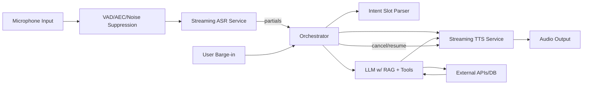

# 📄 Product Requirements Document (PRD)  
**Product:** Real-time Voice AI Assistant  
**Owner:** Paul Wu  
**Executor:** Claude (Autonomous Agent)  
**Version:** v1.0  
**Objective:** Build and deploy a voice-based AI assistant with natural, real-time conversational interactions and multimodal extension capabilities.

---

## 1. Problem Statement
Users want to interact with an AI assistant by voice in real time—without delays, unnatural turn-taking, or clunky workflows. Current assistants lack:
- Smooth **barge-in handling** (interrupting AI while it’s speaking).  
- **Streaming ASR and TTS** for near-instant feedback.  
- A **dialogue policy** that blends LLM reasoning with fast intent recognition.  
- Enterprise-grade **privacy, safety, and observability**.

This PRD defines a full-stack system enabling natural, human-like, voice-first interaction.

---

## 2. Goals & Non-Goals
### ✅ Goals
1. Sub-1 second round-trip latency (speech → reasoning → speech).  
2. Natural conversational flow (barge-in, backchannels, partial responses).  
3. Modular, vendor-agnostic design (swappable ASR/TTS/LLM).  
4. Deployable to **iPhone client** + cloud backend.  
5. Action-ready: calendar lookup, weather, knowledge Q&A (demo set).  

### ❌ Non-Goals
- Multi-language support in v1 (English only).  
- Complex UI/UX beyond a microphone button + chat log.  
- Non-iOS clients (Android/Web) until v2.  

---

## 3. System Architecture

---

## 4. Core Components

### 4.1 Frontend (iPhone app)
- Mic capture with built-in **AEC/NS** via iOS APIs.  
- **WebRTC transport** for low-latency audio.  
- UI: mic button, live transcript, chat log.  
- Playback of assistant audio with **ducking** on barge-in.  

### 4.2 Backend Services
1. **Gateway (WebRTC → gRPC)**  
   - Accepts audio packets, forwards to ASR.  
   - Streams TTS audio back to client.  

2. **Streaming ASR**  
   - Use OpenAI Whisper streaming or Vosk/Deepgram.  
   - Emit `partial_transcript` and `final_transcript` events.  

3. **Orchestrator (Python FastAPI service)**  
   - Event-driven loop (ASR → NLU/LLM → TTS).  
   - Fast intent parser (Regex/Spacy) for common commands.  
   - Routes complex reasoning to LLM.  
   - Manages barge-in: cancel/pause TTS when new speech detected.  

4. **LLM & Tools**  
   - LLM: GPT-4o-mini or Claude Sonnet (with streaming).  
   - Tools: Calendar API, Weather API, Vector DB for retrieval.  
   - Schema validation: JSON schema enforced before tool calls.  

5. **Streaming TTS**  
   - Option A: OpenAI TTS  
   - Option B: ElevenLabs streaming API  
   - Must return first audio frame <300 ms.  

---

## 5. Technical Requirements

### 5.1 Latency Budget
- Mic → Gateway: ≤80 ms  
- ASR first partial: ≤150 ms  
- Endpoint detection: ≤150 ms  
- LLM first token: ≤200 ms  
- TTS first audio: ≤200 ms  
- **Total: ≤700 ms target, ≤1000 ms max**  

### 5.2 Turn-Taking & Barge-In
- Full-duplex audio: capture mic while playing TTS.  
- Detect VAD activity >100 ms → trigger barge-in.  
- Cancel current TTS stream and resume ASR.  

### 5.3 Privacy & Safety
- Encrypt all transport (TLS, DTLS-SRTP).  
- Never store raw audio by default.  
- Sensitive actions (e.g., send message) require confirmation.  

---

## 6. Implementation Plan (Actionable Steps)

### Phase 1 – Setup & Infrastructure
1. **Provision cloud infra:**  
   - Use AWS/GCP/Azure.  
   - Deploy k8s cluster with GPU node pool.  
   - Configure Istio or NGINX ingress.  

2. **Set up repos:**  
   - `frontend-ios/` (Swift + WebRTC)  
   - `backend-gateway/` (Node/Python WebRTC bridge)  
   - `backend-services/` (FastAPI orchestrator, ASR, TTS, tools)  
   - CI/CD with GitHub Actions.  

---

### Phase 2 – Core Audio Pipeline
1. Implement mic → WebRTC → backend transport.  
2. Integrate **AEC/NS/VAD** via iOS APIs.  
3. Connect to streaming ASR (Whisper/Deepgram).  
4. Implement partial + final transcript events.  

---

### Phase 3 – Orchestration & NLU
1. Build orchestrator service in FastAPI.  
2. Handle events: `asr.partial`, `asr.final`, `barge_in`.  
3. Implement rule-based **fast intent parser**.  
4. Route final transcript to **LLM** (Claude/GPT).  
5. Add retrieval (e.g., Qdrant vector DB).  

---

### Phase 4 – TTS & Response Handling
1. Integrate streaming TTS (OpenAI/ElevenLabs).  
2. Chunk LLM responses into phrases for incremental speech.  
3. Support **edit/replace** when partial transcripts change.  
4. Implement playback with **barge-in cancelation**.  

---

### Phase 5 – Tools & Integrations
1. Add calendar integration (Google Calendar API).  
2. Add weather API (OpenWeather).  
3. Add knowledge RAG (vector DB).  
4. Enforce JSON schema for tool responses.  

---

### Phase 6 – Safety, Privacy, & Telemetry
1. Add content filters on ASR and LLM outputs.  
2. Encrypt user data at rest (KMS-managed keys).  
3. Build telemetry pipeline (Kafka/Redpanda → Prometheus → Grafana).  
4. Track latency, WER, tool success, user satisfaction.  

---

### Phase 7 – Deployment & Testing
1. Deploy backend on k8s.  
2. Publish iOS app (TestFlight).  
3. Run load tests: simulate 100 concurrent users.  
4. Run noise robustness tests (cafe, car, TV).  
5. Evaluate latency & MOS (Mean Opinion Score).  

---

## 7. Success Metrics
- **Latency:** median turn <700 ms.  
- **Barge-in success:** >90%.  
- **WER (ASR):** <8% in quiet, <15% in noise.  
- **MOS (TTS quality):** >4.2/5.  
- **Dialog success rate:** >80% (task completion).  

---

## 8. Risks & Mitigations
- **High latency:** Optimize with GPU inference, streaming APIs.  
- **TTS unnaturalness:** Choose voices with prosody controls.  
- **Privacy concerns:** On-device ASR/TTS in v2.  

---

✅ **Deliverable:** A working, end-to-end iOS app + backend stack, deployed on cloud, supporting real-time natural conversations with tool integrations.  
